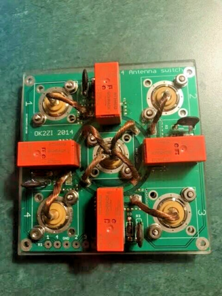

# Remote antenna switch

This is a remote controller for one of those DIY antenna switch kits. It listens on Wifi for commands and controls the relays. They take a +12V signal to one of 4 relays with a common ground to pick which port is active, and ground the rest:

The firmware for this allows both manual control, and to listen to N1MM+/RUMLogNG broadcasts to pick the band based on configured port/band combinations.

Manual control - go to the web and select the port you want

Auto selection - listens on 12060/UDP for station messages indicating the frequency. You select the antennas that work on each port and it picks the first one. If you go to the web and override it, it'll last until you switch bands.

When the device boots without a config it'll start a new AP for you to configure it.
